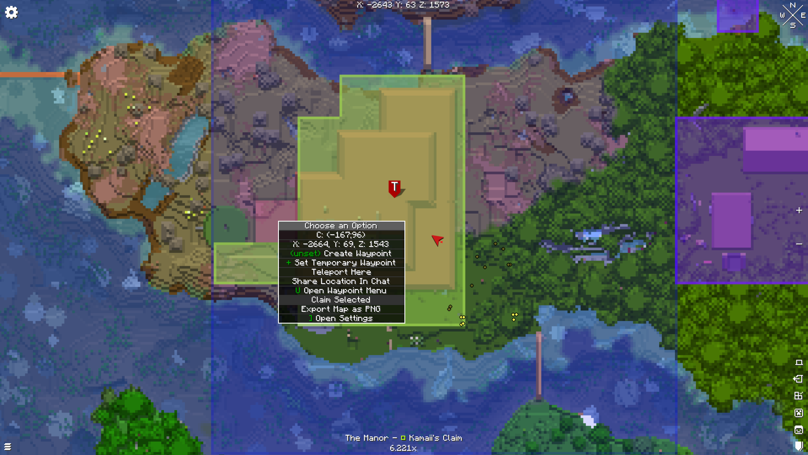

# Optimal graphics settings

1.  Video Settings

    <figure><figcaption></figcaption></figure>

2\. General

<figure><figcaption></figcaption></figure>

2.1 Rendering Distance - directly affects FPS&#x20;

I recommend leaving it at 8 - 12 chunks, for low end PC's set it to 2-6

When running around new chunks you should set it to minimal since server has minimal rendering distance. Also clients are able to cache chunks locally, so when running around your own base and when you loaded it fully, you could see chunks at unlimited distance. (Depends on amount of loaded chunks.)

2.2 Max Shadow Distance - affects FPS slightly&#x20;

I don't see any changes myself so i recommend setting those to Disabled

2.3 Simulation Distance - Minimal&#x20;

2.4 Full-screen , Depends - find better option for yourself.&#x20;

2.5 VSync - Always off , unless you see visual lags or you want to decrease GPU load.

2.6 Max Frame-rate - Unlimited&#x20;

3.0 Quality&#x20;

<figure><figcaption></figcaption></figure>

3.1 Graphics - This one toggles a lot of options that we might set manually. For performance - Fast

3.2 Clouds - Despite being not that important they take a lot of time to actually render, set to off.

3.3 Leaves Quality - Fast meaning Performance , Fancy - Slower, Smart - Hybrid of both.&#x20;

3.4 Particles - Decreased or Off.&#x20;

3.5 Smooth lighting - take some FPS, not that heavy but you should turn it off.&#x20;

3.6 Entity Distance , would be disabled further so doesn't matter.&#x20;

<figure><figcaption></figcaption></figure>

This might be useful when you have lots of mobs around, but due to having Culling in the pack its not that effective. Leave it as it is.&#x20;

3.7 Vignette - usually does not affect FPS&#x20;

4.0 - Performance Section

<figure><figcaption></figcaption></figure>

4.1 - Chunk Updates to MAX

4.2 - Always Defer Chunks Updates - This allows you to have more stable FPS when chunk updates or you load new one, but it may create some instability.&#x20;

<mark style="color:red;">**In this exact case "High" means positive impact!**</mark>

<figure><figcaption></figcaption></figure>

4.3 Culling / Occlusion

These should be always turned on , they work as an optimization.

<figure><figcaption></figcaption></figure>

5.0 - Extras&#x20;

<figure><figcaption></figcaption></figure>

5.1 - Memory Allocator - Async for modern GPU's , SWAP for very old PC's&#x20;

5.2 - Persistent Mapping - Always on&#x20;

5.3 - CPU Render-Ahead Limit - 9 (Might cause issues, experiment with it.)

5.4 Direct Memory Aces - Always on&#x20;

5.5 True Darkness - doesn't affect FPS, might be annoying for someone. This makes night be darker and ignore brightness.&#x20;

5.6 - Fog - Doesn't lag that much, together with occlusion may have positive effect acting like a penumbra.&#x20;

5.7 - Max Entity Distance - Disabled&#x20;

5.8 These define how far away entities would be rendering, experiment and set your own.&#x20;

I use 64 - 32 - 64 - 16&#x20;

<figure><figcaption></figcaption></figure>

5.9 Dynamic Lights

Those are quite heavy calculations, you better disable it.&#x20;

<figure><figcaption></figcaption></figure>

